# How to update links to the add-in

The add-in in a site may have a new url when we use Visual Studio to side load a new version of the add-in. If that's the case, we have to update all the links to the add-in in the site. This document contains all the necessary steps to update all the links to the add-in in the site.

# Steps

1. Get the latest ID of the add-in

   1. Go to Site Contents

      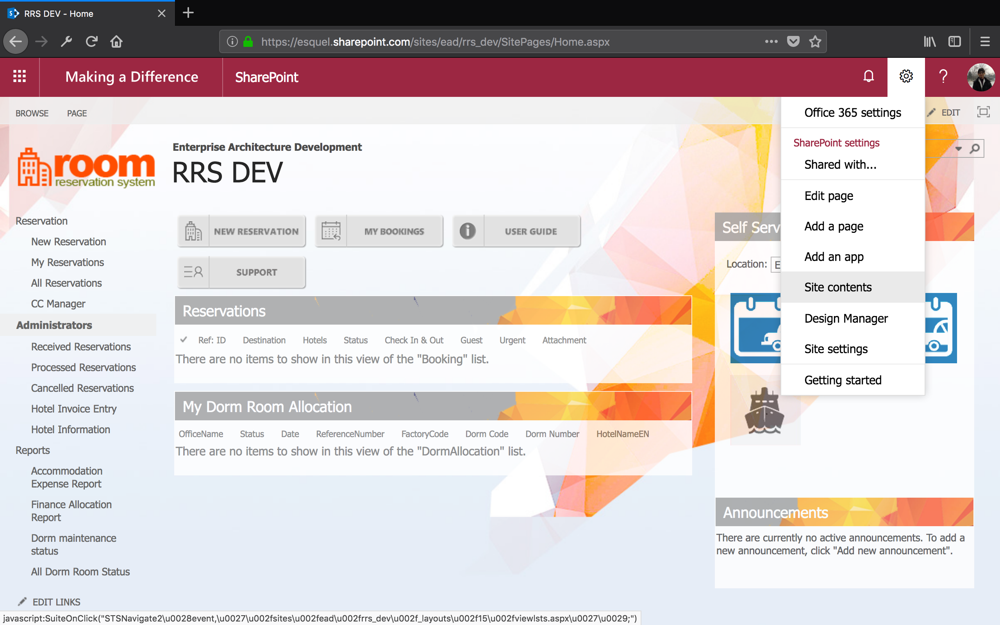

   1. Open the add-in

      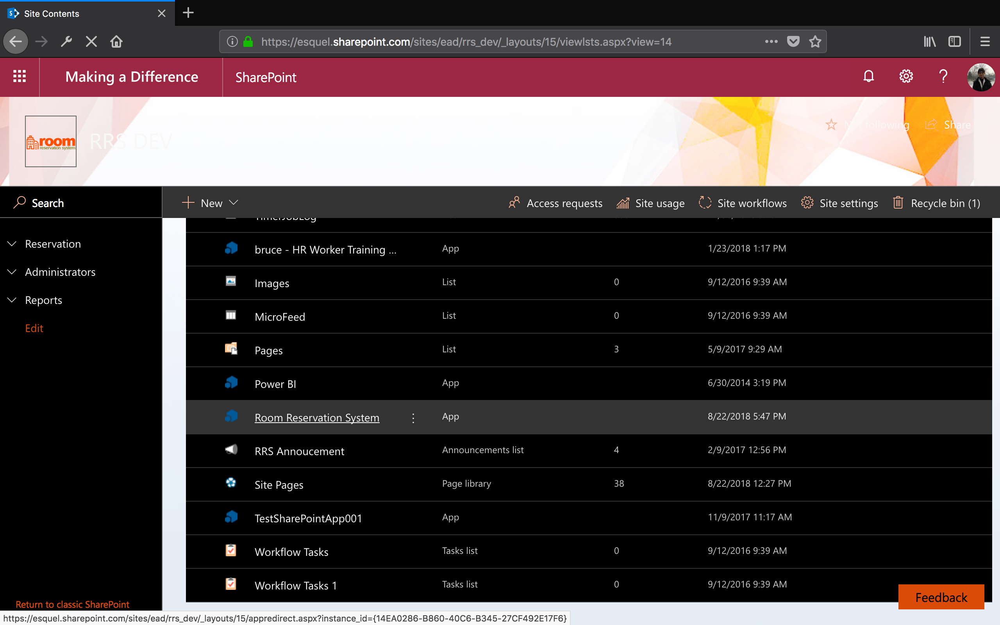

   1. Copy the add-in ID

      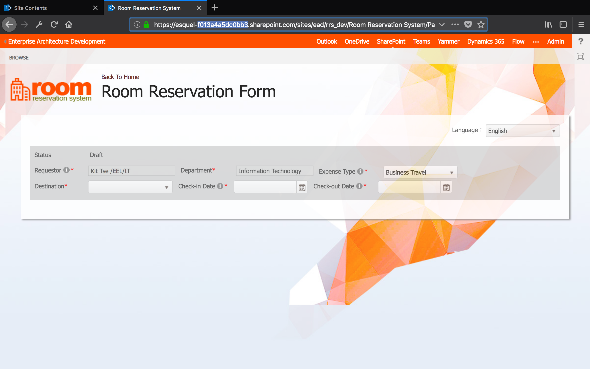

1. Update the links to the add-in in System Parameters

   1. Go to Site Contents

      

   1. Open System Parameters

      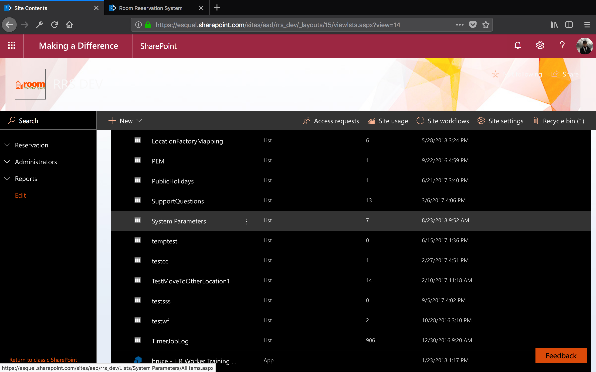

   1. Update AppURL

      Replace the old ID with the new ID

      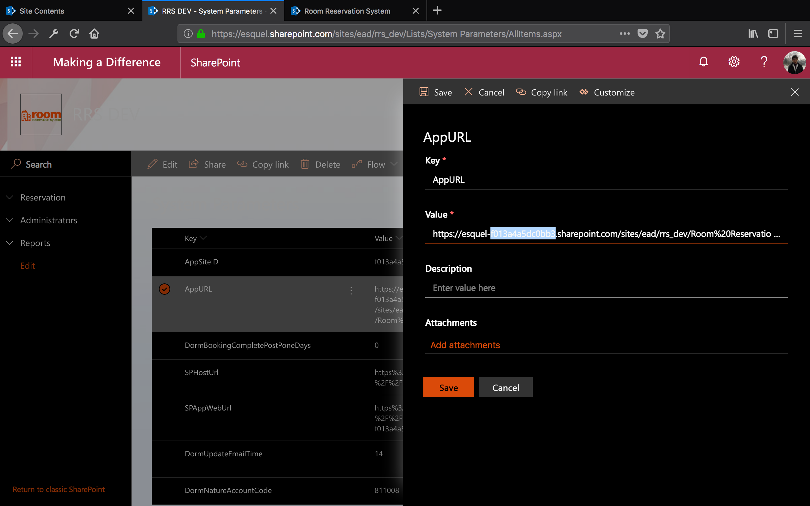

   1. Update SPAppWebUrl

      Replace the old ID with the new ID

      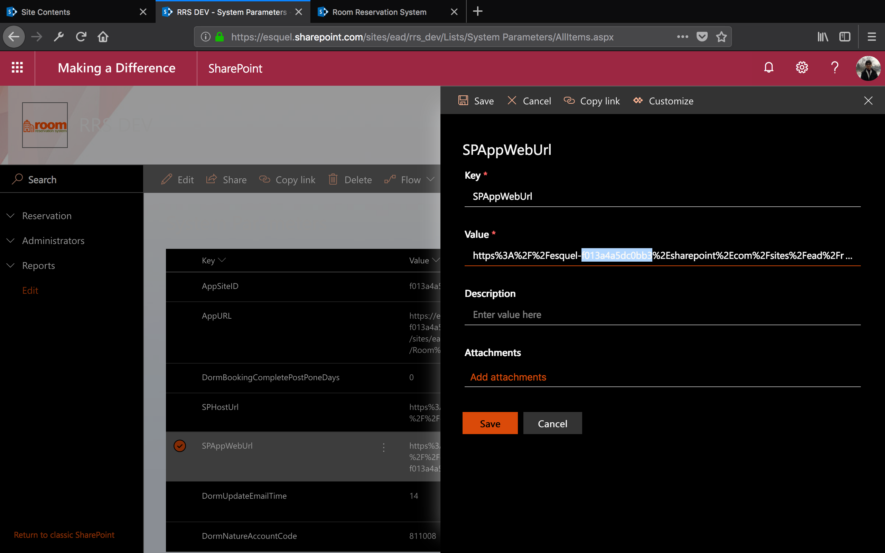

1. Update the links to the add-in in navigation

   1. Go to Site Settings

      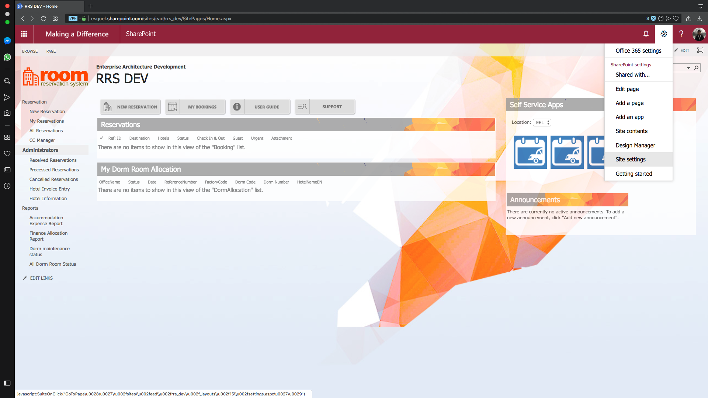

   1. Open Navigation

      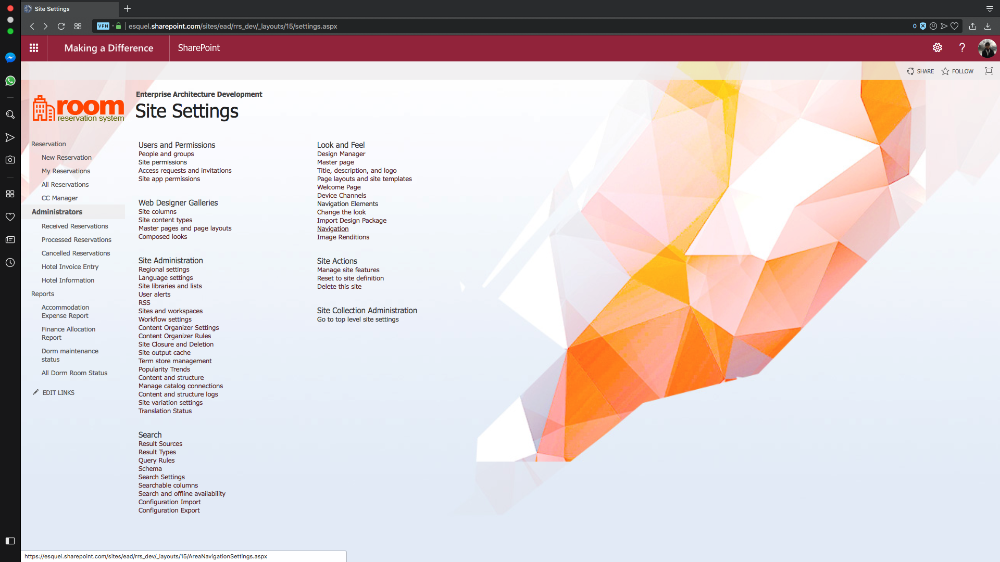

   1. Update New Reservation

      Replace the old ID with the new ID

      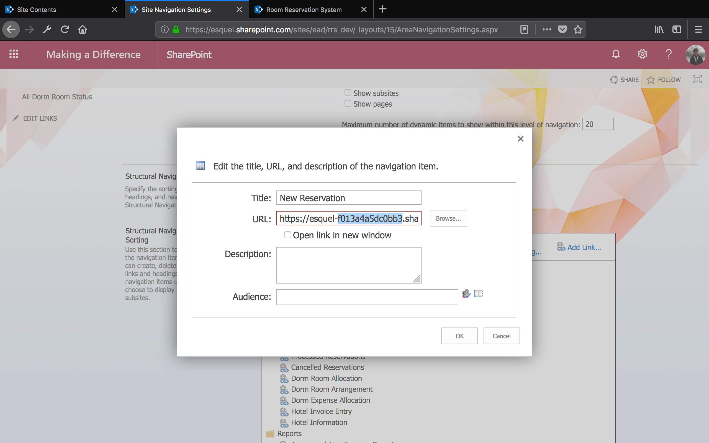

   1. Update Dorm Room Allocation

      Replace the old ID with the new ID

      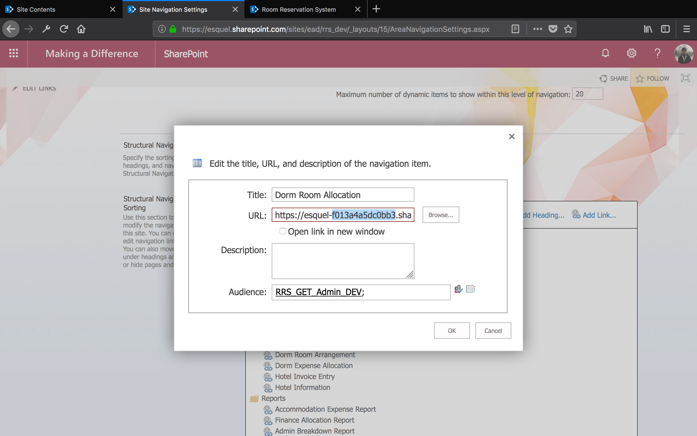

1. Update the link to the add-in in landing page

   1. Open the site with SharePoint Designer 2013

   1. Open Site Pages

   1. Open Home.aspx

      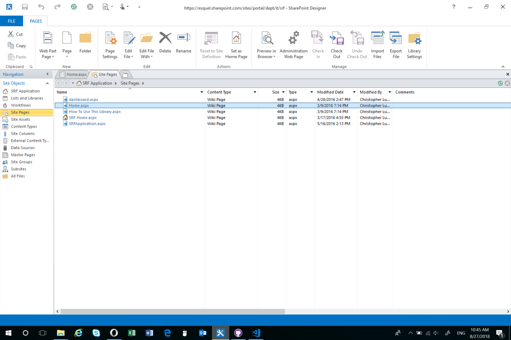

   1. Click Edit File

      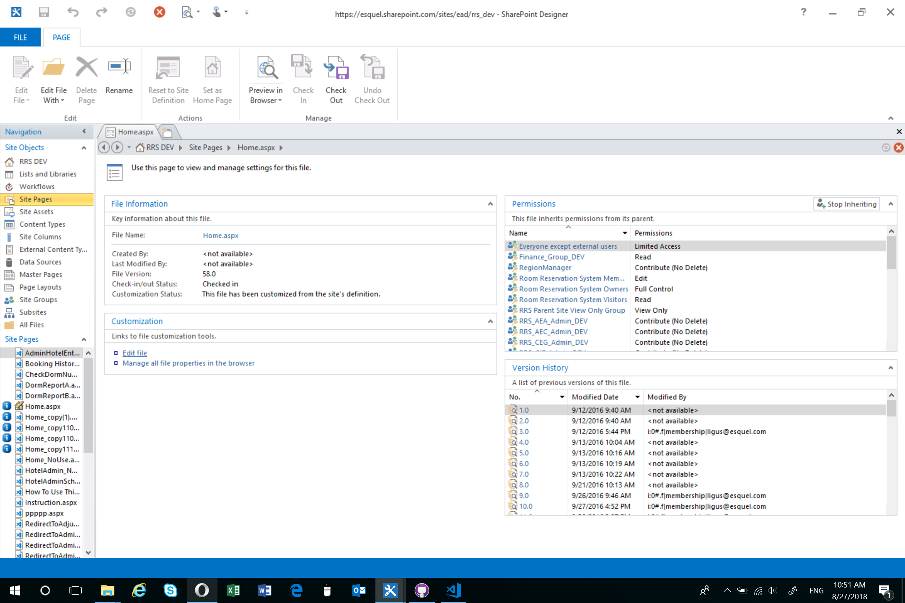

   1. Update source code
   
      Replace the old ID with the new ID. The old ID can be found in somewhere around line 51

      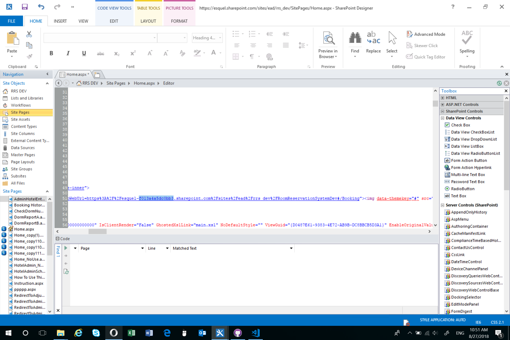
      
